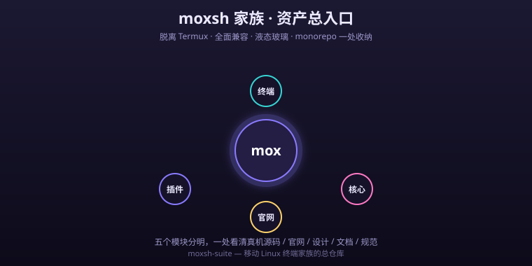

# moxsh 总仓库 · monorepo

<p align="center">
  
  
  
  
</p>


<p align="center"><a href="README.md">中文</a> · <a href="README.en.md">English</a></p>

> **moxsh** —— 完全脱离 Termux、全面兼容 Termux、性能更强、**整个 App 都是液态玻璃**的移动 Linux 终端。

本仓库是 moxsh 家族的**资产总入口**：把散落在各处的真机源码、官网、设计原型、文档与规范集中收纳，五块分明，一眼看清。

<p align="center"></p>

<p><b>⭐ 如果 moxsh 对你有用,欢迎点个 <a href="https://github.com/codecloud-dev/moxsh-suite">Star</a> —— 它能让更多开发者发现这个移动 Linux 终端!</b></p>


## 🐛 欢迎来“批斗”我

> 这是个刚起步的项目，**bug 肯定有，而且不少**。我不装完美——
> 你踩到的每一个坑、每一个槽点，都是帮我把它养好的机会。

- 💥 遇到崩溃 / 黑屏 / 跑不起来？→ [提个 Bug 报告](https://github.com/codecloud-dev/moxsh-suite/issues)
- 💡 有想要的功能？→ [开个需求](https://github.com/codecloud-dev/moxsh-suite/issues)
- 🗯️ 单纯想吐槽、挑刺？→ 也欢迎开 issue，标签随便打 😄

每个 issue 我都会看，能修的尽快修。一起把它从“能跑”养到“好用” 💪

<p>💛 觉得好用？欢迎到 <a href="https://afdian.com/a/cloudharbor">爱发电</a> 请作者喝杯咖啡 —— 国内可直接微信 / 支付宝收款，是独立开发最大的鼓励。</p>

<p align="center"></p>

<details>
<summary>📑 目录 · Contents</summary>

- [🗃️ 仓库拓扑](#仓库拓扑)
- [🔗 子模块锁定版本](#子模块锁定版本)
- [📑 目录导航](#目录导航)
- [🚀 快速开始](#快速开始)
- [🌐 在线体验](#在线体验)
- [📊 关键资产速览](#关键资产速览)
- [🔹 构建与贡献](#构建与贡献)
- [📜 许可证](#许可证)

</details>

## 🗃️ 仓库拓扑

```text
moxsh-suite  (本仓库 / monorepo，默认分支 master)
├── app/    → git submodule → codecloud-dev/moxsh-terminal   (Android 真机源码)
├── site/   → git submodule → codecloud-dev/mox-site          (官网 + 在线体验)
├── design/ (实体文件)  UI 原型 HTML + 自动化回归测试
├── docs/   (实体文件)  设计 / 学习笔记、验收报告
└── spec/   (实体文件)  插件清单 JSON 规范 (Schema + 多套示例)
```

两个子仓库均为 **public**，默认分支 `main`。

## 🔗 子模块锁定版本

| 子模块 | 仓库 | 锁定提交（大版本 1.0.0） |
|---|---|---|
| `app`  | `codecloud-dev/moxsh-terminal` | `dad8ff5`（[v1.0.0](https://github.com/codecloud-dev/moxsh-terminal/releases/tag/v1.0.0)） |
| `site` | `codecloud-dev/mox-site`        | `bcdc62b`（[v1.0.0](https://github.com/codecloud-dev/mox-site/releases/tag/v1.0.0)） |

> 本仓库随 MoX 全家桶一同升到 **1.0.0** 大版本里程碑：两个子模块均已 bump 到各自的 v1.0.0 发布提交。其余公开仓库（agent-core / moxsh-plugins / moxwebgpu）也已同期发布 1.0.0；moxbox / moxcode 仍属「规划中 · 待定」，本次不做。

说明：锁定提交是 monorepo 初始化时的快照。子仓库演进后，在 `moxsh-suite` 中 `cd` 进子模块 `git pull` 再回到根目录 `git add app site && git commit` 即可 bump 版本。

## 📑 目录导航

| 路径 | 内容 |
|---|---|
| `app/moxsh/ui/` | 自研 Canvas 终端渲染层、液态玻璃组件库（`Glass.kt` / `MoxshTokens.kt` / `MoxshComponents.kt`） |
| `app/moxsh/plugins/plugin-distro/` | 图形化容器管理四件套（发行版管理器 / 包管理器 / 资源监控 / 新手引导） |
| `app/moxsh/plugins/plugin-ai/` | AI 助手（多模型接入 + 技能 + Agent 工具） |
| `site/` | 官网静态站 + 在线体验页（`experience.html` 嵌入 `prototype.html`） |
| `design/moxsh-ui-mockup.html` | 主交互原型（也是 `site/prototype.html` 的来源） |
| `design/tests/test_ui.js` | Playwright 原型回归测试（终端 / 四件套 / 会话抽屉 / 0 报错） |
| `docs/` | Podroid UI 学习笔记、验收报告 |
| `spec/plugin-manifest.schema.json` | 插件清单 Draft 2020-12 JSON Schema（41 顶层字段） |
| `spec/examples/` | 开源免费 / 闭源免费 / 闭源付费(爱发电) / 订阅制 / 系统内置 五套真实示例 |

## 🚀 快速开始

```bash
git clone https://github.com/codecloud-dev/moxsh-suite.git
cd moxsh-suite
git submodule update --init --recursive   # 拉取 app / site
```

**代理拉取（中国大陆 / 受限网络）**：在 `clone` 之前设置 insteadOf，让 git 自动走 `ghproxy` 镜像：

```bash
git config --global url."https://ghproxy.net/https://github.com/".insteadOf "https://github.com/"
```

## 🌐 在线体验

官网已部署 GitHub Pages（源：`mox-site` 的 `main` 分支根目录）：

- 在线体验页：<https://codecloud-dev.github.io/mox-site/experience.html>
- 官网首页：<https://codecloud-dev.github.io/mox-site/>

本地预览：直接用浏览器打开 `site/index.html`，或 `design/moxsh-ui-mockup.html`。

## 📊 关键资产速览

### 🎨 design/ — UI 原型

- `moxsh-ui-mockup.html` —— **主原型**：全应用液态玻璃；底部三键（终端 / 分类 / 设置）；**会话抽屉**（Termux 式：环境色点 / 长按改名 / 退出码红删除线 / 新建）；**针对小白的图形化容器管理四件套**（发行版管理器 / 图形包管理器 / 资源监控 / 新手引导）；控制中心（音量+键呼出、跟手）；AI 助手配置屏。
- `tests/test_ui.js` —— Playwright 回归，覆盖终端 10 行、四件套 4 卡、会话抽屉可用、首页 2 入口、0 控制台报错。

### 🧩 spec/ — 插件清单规范

- `plugin-manifest.schema.json` —— Draft 2020-12 JSON Schema，41 个顶层字段、19 个复用定义。
- `README.md` —— 规范文档（身份 / 开源闭源 / 定价与授权 / 爱发电 / 兼容 / 分发 / 入口 / 权限 / 依赖 / 能力 / 设置 / 签名）。
- `examples/` —— 开源免费 / 闭源免费 / 闭源付费(爱发电) / 订阅制(AI) / 系统内置 五套真实示例，均通过 `ajv` 校验。

### 🗃️ app/ — 真机源码（子仓库）

- `moxsh/ui/` —— 自研 Canvas 终端渲染、液态玻璃组件库。
- `plugin-distro/` —— 图形化容器管理四件套（Compose 屏幕）。
- `plugin-ai/` —— AI 助手（模型接入 + 技能系统 + Agent 工具）。

## 🔹 构建与贡献

- **App 编译 / 发布**：见 `app` 子仓库 `README.md`（需要 Android SDK / NDK / Rust 工具链）。
- **官网改动**：见 `site` 子仓库，推 `main` 后 GitHub Pages 自动构建。
- **本仓库职责**：仅收纳资产与规范。子模块版本演进后，在子仓库推进、于本仓库 bump gitlink 再提交即可。

## 📜 许可证

各子仓库自带 `LICENSE`；本仓库收纳的资产沿用对应子仓库协议。

---

moxsh · 让手机上的 Linux 像 iOS 一样顺滑。
